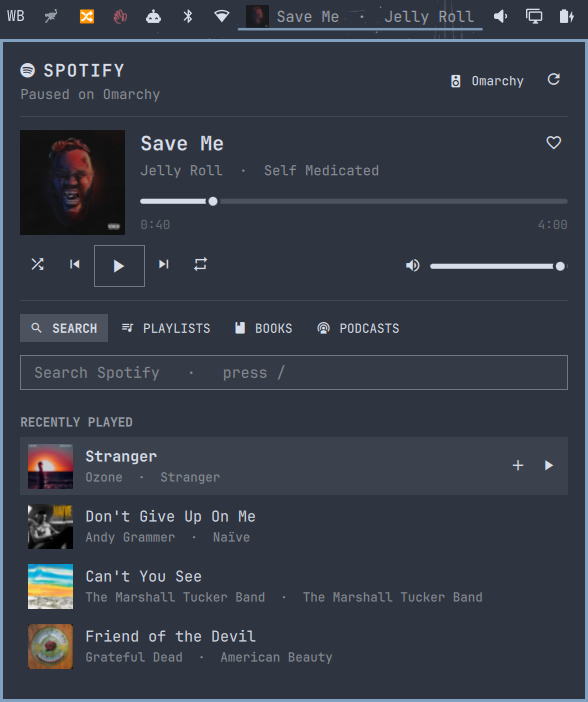
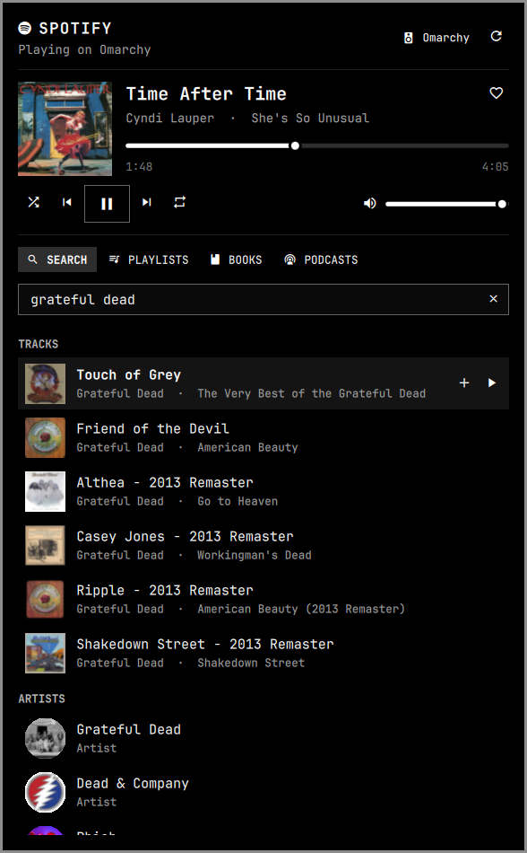
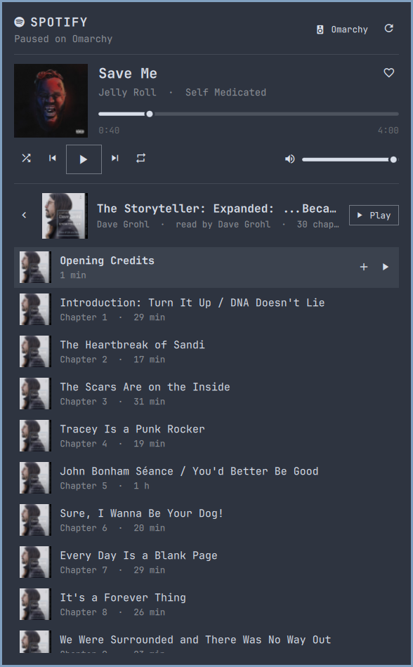
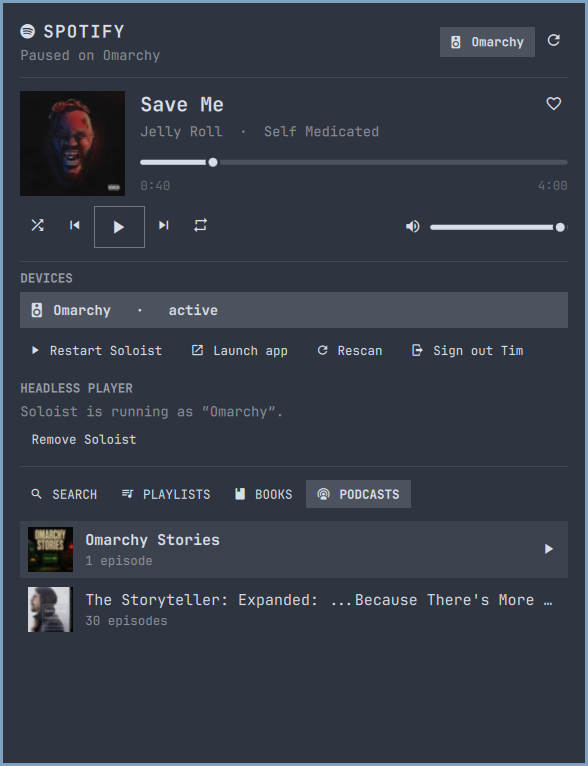

# Spotify for Omarchy

Spotify, living in your Omarchy bar.

The bar shows a little cover of whatever is playing. Click it and you get the
whole thing: album art, play/pause/skip, a seek bar, volume, a heart, your
playlists, audiobooks and podcasts, and search across all of Spotify. It can
even play music with no Spotify window open at all.



| Search results | Audiobook chapters | Devices and headless player |
|---|---|---|
|  |  |  |

## What you get

- **In the bar:** the current cover art (or the last thing you played) and a
  scrolling "Title · Artist". Left-click opens the panel, middle-click
  pauses, right-click skips, scrolling changes the volume.
- **Now playing:** big cover, title, artist and album, a seek bar you can
  drag, shuffle / previous / play / next / repeat, a volume slider, and a
  heart that saves the track to your library.
- **Search:** type once and get tracks, artists, albums, playlists, podcasts,
  episodes and audiobooks, grouped. With nothing typed you see what you
  played recently.
- **Playlists:** Liked Songs plus everything you made or follow. Open one to
  see its tracks, play from any row, or shuffle the whole thing.
- **Books:** your saved audiobooks, with every chapter and how far you got.
- **Podcasts:** shows you follow, with episodes, dates, length and progress.
- **Devices:** switch between your computer, phone, speakers and so on, or
  set up a headless player that needs no window (more below).
- **Keyboard:** everything works without a mouse. See the cheat sheet.

## Before you start

You need three things. Two of them are Spotify's rules, not ours.

1. **Spotify Premium.** Spotify only lets Premium accounts be controlled
   this way.
2. **A Spotify "developer app".** This is a free, two-minute step on
   Spotify's website that gives the plugin permission to talk to your
   account. Every person needs their own; Spotify does not allow sharing
   one. The panel walks you through it.
3. **Something to play the sound.** The panel is a remote control, not a
   speaker. It drives any Spotify Connect device: the Spotify desktop app,
   your phone, a speaker, or the headless player the panel can install for
   you.

## Install

```sh
omarchy plugin add https://github.com/ninepointlabs/omarchy-spotify.git --enable
```

The chip appears in the right section of the bar. Put it wherever you like:

```sh
omarchy bar move ninepointlabs.spotify --before omarchy.audio
```

If you cloned this repository instead, run `./install.sh` from inside it.

## Connect your account

Click the chip. The panel shows three steps; here they are in full.

1. Open <https://developer.spotify.com/dashboard>, sign in with your Spotify
   account, and click **Create app**. Name it anything you like.
2. In the app's settings, under **Redirect URIs**, type exactly

   ```
   http://127.0.0.1:8888/callback
   ```

   then click **Add**, tick **Web API**, and **Save**. Spotify rejects
   `localhost`, so use the numbers. (If you ever see
   *"redirect_uri: Not matching configuration"*, this line is wrong or was
   never saved.)
3. Copy the app's **Client ID** into the panel and click **Connect**. Your
   browser opens Spotify's permission page; approve it and the panel
   switches to the player by itself.

That's the whole connection. It stays connected for six months; after that
the panel shows the same card again and one click renews it.

## Pick something to play through

Open the device button at the top right of the panel. Anything already
running Spotify on your account is listed; click one to play there.

### Option A: the Spotify desktop app

Simplest. Install it with the panel's **Install Spotify** button (or
`omarchy install service spotify`), open it once, and it appears in the
list. If you'd rather never see its window, start it hidden at login by
adding these two lines to your Hyprland Lua config:

```lua
-- ~/.config/hypr/autostart.lua
o.launch_on_start("spotify")

-- ~/.config/hypr/hyprland.lua
o.window("^(spotify|Spotify)$", { workspace = "special:spotify silent" })
```

Run `hyprctl reload`, then `hyprctl configerrors` to be sure it took.

### Option B: a headless player (no window, ever)

Spotify publishes a small program called **Spotify Soloist** that plays
music as a background service. The panel installs and runs it for you.
Under the device button, in **Headless player**:

1. Click **Set up Soloist…**. The panel downloads it, sets up the background
   service, and adds a weekly refresh (Spotify's builds stop working after
   90 days, so the refresh matters).
2. Get a key from <https://developer.spotify.com/dashboard>: open
   **Spotify Soloist API Key**, accept the terms, click Generate. Paste it
   into the panel and click **Start**.
3. Open the Spotify app on your phone or computer, open its device picker,
   and choose **Omarchy** once. That pairs it. Soloist remembers the session
   from then on.

Now the panel lists Omarchy as a device, offers **Start Soloist** if it's
ever stopped, and hands playback to it automatically when nothing else is
playing. **Remove Soloist** takes it all out again.

> **Why not spotifyd or librespot?** Since late 2025 Spotify refuses to give
> those open-source players the keys to decode audio for accounts created in
> the last couple of years. They connect, then skip every track in silence.
> Soloist is Spotify's own engine, so it just works.

## Using it

| Where | Action |
|---|---|
| Bar chip, left click | open or close the panel |
| Bar chip, middle click | play / pause |
| Bar chip, right click | next track |
| Bar chip, scroll | volume up / down |
| Cover in the panel | play / pause |
| A row, click | play it (tracks, episodes, chapters, artists) or open it (playlists, albums, podcasts, audiobooks) |
| A row, right click | add to queue |
| Hover a row | reveals **+** (queue) and **▶** (play) |
| Device button | switch device, start or set up Soloist, sign out |

### Keyboard cheat sheet

| Key | Does |
|---|---|
| `j` / `k` or arrows | move between rows |
| `Enter` | open or play the highlighted row |
| `Space` | play / pause |
| `n` / `p` | next / previous |
| `s` | shuffle on / off |
| `f` | save / unsave the current track |
| `+` / `-` | volume up / down |
| `q` | queue the highlighted row |
| `/` | jump to the search box (`Esc` leaves it, `↓` jumps to results) |
| `1` `2` `3` `4` or `h` / `l` | switch tabs |
| `h` or `Esc` | go back out of a playlist, book or podcast |
| `d` | devices |
| `r` | refresh |
| `Tab` / `Shift+Tab` | switch to the next / previous bar panel |
| `Esc` | close |

## Settings

These live on the widget's entry in `~/.config/omarchy/shell.json`. Change
them with `omarchy bar set ninepointlabs.spotify <key> <value>`.

| Key | Default | What it does |
|---|---|---|
| `clientId` | `""` | Your developer app's Client ID. The panel fills this in. |
| `redirectPort` | `8888` | The port in the redirect URI. Change both if 8888 is taken. |
| `showTrack` | `true` | Show "Title · Artist" next to the cover in the bar. |
| `maxLabelWidth` | `180` | How wide that text may get before it scrolls. |
| `defaultTab` | `"search"` | Which tab opens first. Remembers the last one you used. |

## If something's off

- **"redirect_uri: Not matching configuration"** when connecting: the
  redirect URI in your Spotify app is not exactly
  `http://127.0.0.1:8888/callback`, or wasn't saved. Fix it, then click
  Connect again.
- **"No active device"**: nothing is playing Spotify right now. Open the
  device button and pick one, launch the desktop app, or start Soloist.
- **"Spotify Premium is required"**: the account you connected isn't
  Premium. Spotify won't allow playback control without it.
- **"Spotify rate limit hit"**: you clicked a lot very fast. It clears in a
  few seconds.
- **"Your Spotify session expired"**: six months passed. Click Connect.
- **"Soloist build expired"**: the weekly refresh didn't run. Click
  **Reinstall Soloist**, or run `soloist-update` in a terminal.
- **Soloist starts but skips every track silently**: that's the librespot
  problem above, which Soloist doesn't have. Make sure `spotifyd` or another
  player isn't the active device.
- **Panel says "Spotify only lists tracks for playlists you own"**: a
  Spotify limit for playlists made by other people. Play still works.
- Something else: run
  `~/.config/omarchy/plugins/ninepointlabs.spotify/bin/spotify-bridge status`
  in a terminal and look at what it prints, and `journalctl --user -u soloist`
  for the headless player.

## Uninstall

```sh
omarchy plugin remove ninepointlabs.spotify          # the plugin
rm -rf ~/.local/state/omarchy-spotify ~/.cache/omarchy-spotify   # login and cover cache
```

If you set up Soloist, click **Remove Soloist** in the panel first (or run
`bin/spotify-bridge soloist remove`), then optionally
`rm -rf ~/.config/soloist ~/.local/share/soloist ~/.cache/soloist`.

## Scripting

Two IPC targets are available while the shell runs:

```sh
omarchy-shell ninepointlabs.spotify toggle   # open/close the panel
omarchy-shell spotify playPause              # also next, previous, volumeUp, volumeDown
omarchy-shell spotify status                 # JSON: playing, title, artist, device, progress
```

Bind them in `~/.config/hypr/bindings.lua` for media keys. The helper
`bin/spotify-bridge` is a normal command-line tool too; `--help` lists
everything it can do.

## How it's built

- `bin/spotify-bridge` is a Python script (standard library only) that does
  all the talking to Spotify: the login, playback control, your library,
  search, and caching cover art under `~/.cache/omarchy-spotify`. Your login
  is kept in `~/.local/state/omarchy-spotify/auth.json`, readable only by
  you. No client secret is involved.
- `Service.qml` runs once per shell and keeps the state everything else
  reads. It checks the player every 4 seconds while the panel is open, every
  15 while something plays with the panel closed, and every minute when idle.
- `BarWidget.qml` is the chip, `Panel.qml` the popup. They use the same
  building blocks as Omarchy's own panels, so they follow your theme.
- `contrib/` holds the systemd units and updater the Soloist setup installs.

Spotify's February 2026 rules for apps like this one shape a few things:
search shows at most 10 results per type, other people's playlists don't
expose their track lists, and the connection must be renewed every six months.

## Security notes

- **What is stored where.** Your Spotify login (a refresh token, no
  password) lives in `~/.local/state/omarchy-spotify/auth.json`, and the
  Soloist key in `~/.config/soloist/soloist.env`. Both are created with
  mode 0600, readable only by your user. The Client ID in `shell.json` is
  not a secret.
- **Login is PKCE.** There is no client secret anywhere. The one-time
  browser login talks to a listener on `127.0.0.1` only, checks the `state`
  it issued, and escapes anything it echoes.
- **No shell, no eval.** Every command the plugin runs is an argument list;
  nothing from Spotify or from you is ever pasted into a shell string.
  IDs and URIs are validated before they go into an API path. Text from
  Spotify is rendered as plain text, never as rich text.
- **Downloads.** Soloist comes over HTTPS from Spotify's CDN, is extracted
  with Python's safe tar filter, and only the `soloist` file is kept. Cover
  art is HTTPS-only and capped at 8 MB per image.
- **Known limitation.** Soloist only accepts its API key on the command
  line, so the key is visible in the process list to other users on the
  same machine (`ps`). On a single-user desktop that's you; on a shared box,
  treat it accordingly. The plugin itself passes the key over stdin.
- **Nothing phones home.** The plugin talks to `api.spotify.com`,
  `accounts.spotify.com`, Spotify's image CDN, and the Soloist download
  host. That's the full list.
- **It manages a user service, only if you ask.** Nothing touches systemd
  until you click **Set up Soloist…**. That step copies three units from
  `contrib/systemd/` into `~/.config/systemd/user/` (`soloist.service`,
  `soloist-update.service`, `soloist-update.timer`), runs
  `systemctl --user daemon-reload`, and enables them. Everything is
  `--user` scope; the plugin never touches system units and never asks for
  root. **Start Soloist**, **Stop**, and **Restart** in the panel map to
  `systemctl --user start|stop|restart soloist`, and **Remove Soloist**
  disables the units, deletes those three files, and reloads. `install.sh`
  itself only copies the plugin files into place; it does not install or
  start any service.

## License

MIT. See `LICENSE`.
